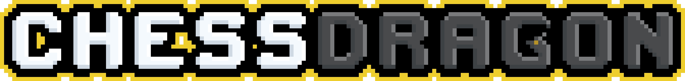
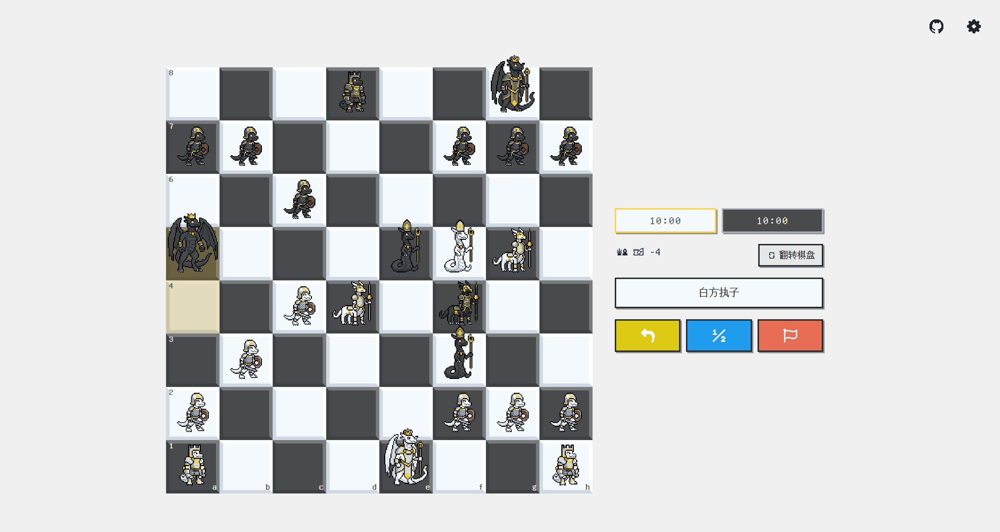

<p align="center">
  
</p>

# 象棋龙 ChessDragon

<p align="center">
  
</p>

一个纯前端实现的像素风格国际象棋小游戏，使用 Vue 3 打造。棋子是我自己画的像素风拟龙原创角色（OC）。

（虽然画技还得修炼XD）  

界面布局模仿了 Chess.com / Lichess 的对局体验，底层**从零实现了一套完整的国际象棋引擎**，没有外部第三方象棋库依赖。

## 功能
- 每枚棋子都是手绘的像素拟龙角色
- 实现完整国际象棋规则，包含王车易位、吃过路兵、升变、逼和、三次重复局面、50 步规则等。 
- 基于 Alpha-Beta 剪枝的 AI，附带基础开局库与简单残局库辅助，提供多级难度
- 内置棋盘编辑器，可自由拜访棋子、构建局面并快速对局。
- 提供基础国际象棋教程，帮助新手玩家了解棋子走法与基本规则
- 仿主流象棋平台的界面设计，支持棋钟、子力差距等辅助功能
- 基于 Vue 3 + Vite 构建，纯前端部署，适配桌面与移动端

## 线上游玩
在 [GitHub Pages](https://dorowolf.github.io/ChessDragon) 立即体验

## 本地运行

```bash
git clone https://github.com/DoroWolf/ChessDragon.git
cd ChessDragon
npm install
npm run dev
```

## 许可与版权

本项目代码使用 [MIT License](LICENSE) 开源。

所有美术设计的版权归原作者所有。角色的二次创作无须授权。
